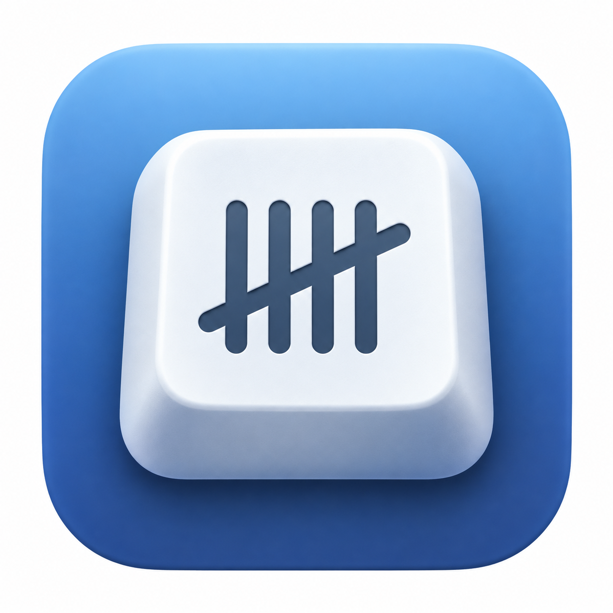

# KeyTally: a small Mac utility for seeing which keys work hardest

*An open-source, local-only keyboard counter for macOS 15 and later*

*The KeyTally icon. Replace this relative path with the hosted image URL when publishing.*

There is a particular kind of Mac problem that only appears after a key has been pressed thousands of times: a sticky space bar, a tired Return key, or one letter that suddenly needs a firmer touch. Most of us notice the failure long before we have any idea which keys did the work.

KeyTally is a small answer to that question. It sits in the macOS menu bar and counts physical key presses by keyboard. The goal is not to record what anyone writes. It is simply to make wear and usage visible: which keys are busiest today, how the total changes over time, and whether the built-in keyboard is doing most of the work or an external one is.

The project uses Apple’s CoreHID framework rather than a global text-event tap. That lets KeyTally keep the built-in keyboard separate from USB and Bluetooth keyboards when macOS exposes enough device metadata to identify them. A press is counted only when a key changes from released to pressed; held-key repeats are ignored. Daily totals and lifetime totals are calculated from the per-keyboard records.

Privacy is the part I wanted to get right from the beginning. KeyTally does not save typed characters, key order, individual timestamps, the active application, window titles, raw HID reports, or network data. Its local JSON file contains aggregate counts, keyboard labels, HID usage IDs, and calendar dates. Input Monitoring permission is still required—this is real keyboard input—but the source is public and the storage boundary is intentionally narrow.

The first version is deliberately modest. It covers ordinary keyboard and keypad usages, a US-style heatmap, per-device totals, daily history, pause/resume, renaming, CSV export, and reset. Media controls, vendor-specific controls, virtual HID devices, device merging, and background analytics are out of scope. External keyboard names are only as reliable as the information macOS provides.

KeyTally is available as source on GitHub: [YueCHEN-DS/KeyTally](https://github.com/YueCHEN-DS/KeyTally). To try it, use macOS 15 or later with Xcode, run `swift test`, build with `./scripts/build-local.sh`, and then grant the exact built app Input Monitoring access in System Settings. The local build is ad-hoc signed by design; it is not an App Store or Developer ID release, and replacing the bundle may require authorization again.

> **IMAGE SLOT — dashboard screenshot**
>
> Replace this block with a real KeyTally dashboard screenshot showing daily
> and lifetime totals before publication.

<!--
Image-generation prompt: “A realistic macOS menu-bar productivity app dashboard named KeyTally, showing a clean US ANSI keyboard heatmap, daily total, lifetime total, and two keyboard cards labelled Built-in Keyboard and USB Keyboard. Native SwiftUI visual language, calm blue and purple accents, no typed words, no personal data, 16:10 screenshot composition.”
-->

> **IMAGE SLOT — keyboard photograph**
>
> Replace this block with a real photo of the Mac’s built-in keyboard beside
> one external keyboard.

<!--
Image-generation prompt: “Editorial technology photograph of an open MacBook beside a compact USB mechanical keyboard and a Bluetooth keyboard, soft daylight on a tidy desk, no brand logos, no readable text, documentary product-review style, horizontal 3:2 composition.”
-->

This is a small project, but small projects are useful places to ask precise questions. Does the count match your experience? Does a particular keyboard reconnect with a stable identity? Are the privacy limits clear enough? If you have a Mac and a keyboard to spare, the repository is open for testing, issues, and careful improvements.
