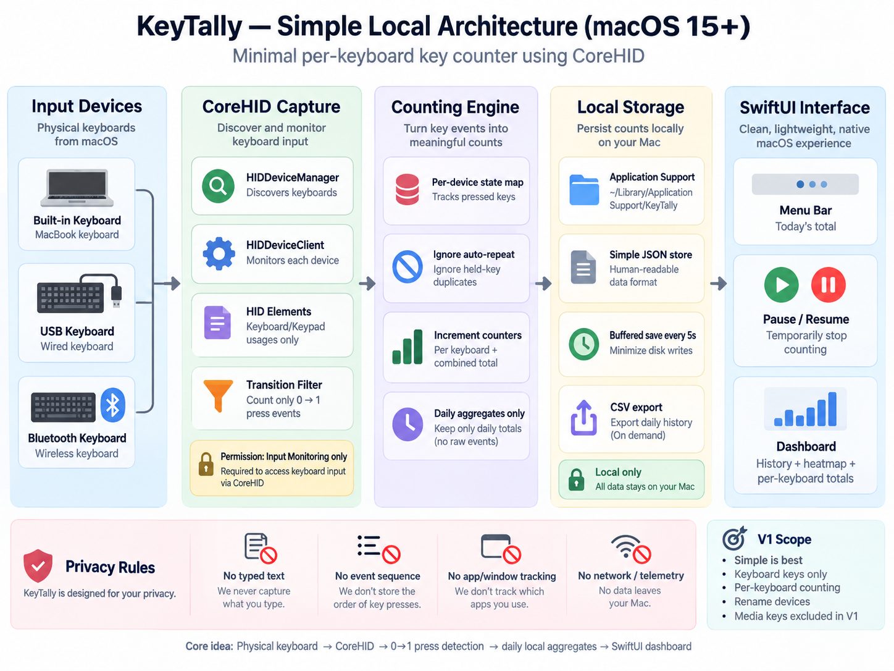
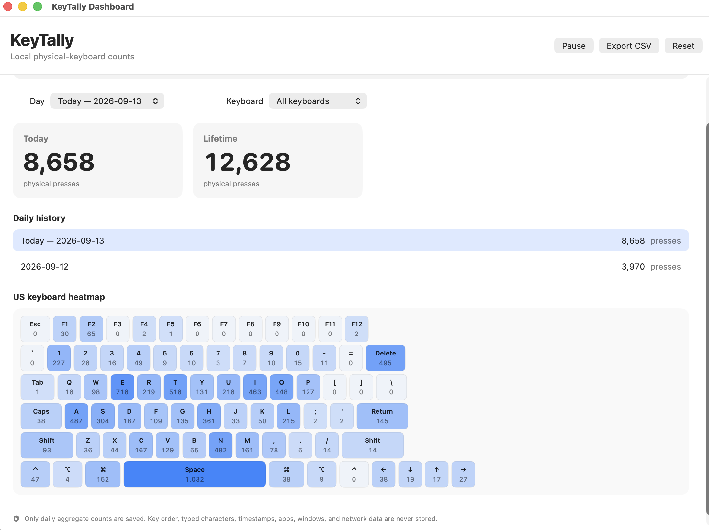

# KeyTally：让 Mac 键盘的使用量变得看得见

*一款面向 macOS 15+ 的本地开源键盘按键统计工具*

*KeyTally 应用图标。*

你的 Mac 键盘上，哪一颗键最辛苦？可能是每天都要按很多次的空格键，也可能是 Return、Shift，或者某个经常出现的字母。等到按键开始发涩、失灵，我们通常只知道“键盘用旧了”，却不知道具体的使用情况。

*KeyTally V1 的流程：实体键盘 → CoreHID → 按键转换计数 → 本地仪表盘。*

KeyTally 想做的事情很简单：它常驻在 macOS 菜单栏，按键盘分别统计实体按键次数。你可以看到今天哪些键最忙、每天的总数如何变化，也可以比较 Mac 内置键盘与 USB、蓝牙键盘的使用量。它不是为了记录你写了什么，而是把键盘的使用和损耗变成一份可观察的数据。

应用使用 Apple 的 CoreHID 来观察实体键盘，而不是用全局文字事件拦截。只要 macOS 提供了足够的设备信息，KeyTally 就能区分内置键盘和外接键盘。应用只把“释放 → 按下”的转换计为一次；长按产生的自动重复不会被反复计算。每日记录和终身累计都从各个键盘的按键汇总中推导出来。

隐私边界是这个项目的核心。KeyTally 不保存输入字符、按键先后顺序、单个事件时间戳、正在使用的应用、窗口标题、原始 HID 报告，也不联网、不发送遥测。保存在本机 JSON 文件中的只有日期、键盘标识、HID 用法编号和累计次数。由于它确实需要读取实体键盘输入，首次使用仍必须在系统设置中授予“输入监控”权限；不同之处在于，代码和数据边界都可以公开审查。

V1 有意保持克制：支持普通 Keyboard/Keypad 用法、US ANSI 键盘热力图、按键盘统计、每日历史、暂停/恢复、重命名、CSV 导出和重置。媒体键、厂商专用控制、虚拟 HID、设备自动合并、复杂的接收器识别和后台分析都不在当前范围内。外接键盘能否显示准确名称，也取决于 macOS 提供的设备元数据。

*仪表盘把选定日期的按键数、终身累计、每日历史和单键热力图放在一起。*

*KeyTally 面向真实的多键盘工作台：Mac 内置键盘，加上一把或多把外接键盘。*

源代码已经公开在 GitHub：[YueCHEN-DS/KeyTally](https://github.com/YueCHEN-DS/KeyTally)。如果你使用 macOS 15 或更高版本，可以安装带 macOS SDK 的 Xcode，运行 `swift test`，再执行 `./scripts/build-local.sh` 构建本地应用，最后在“系统设置 → 隐私与安全性 → 输入监控”中启用当前构建的 KeyTally。项目使用本地 ad-hoc 签名，不是 App Store 或 Developer ID 发行版；替换或重新构建应用后，macOS 可能要求重新授权。

这是一个小工具，但小工具也值得把问题问清楚：统计结果是否符合你的使用习惯？外接键盘重新连接后能否保持稳定身份？隐私说明是否足够明确？如果你手边有一台 Mac 和不止一把键盘，欢迎从 GitHub 获取代码、提交问题，或提出谨慎而具体的改进建议。
